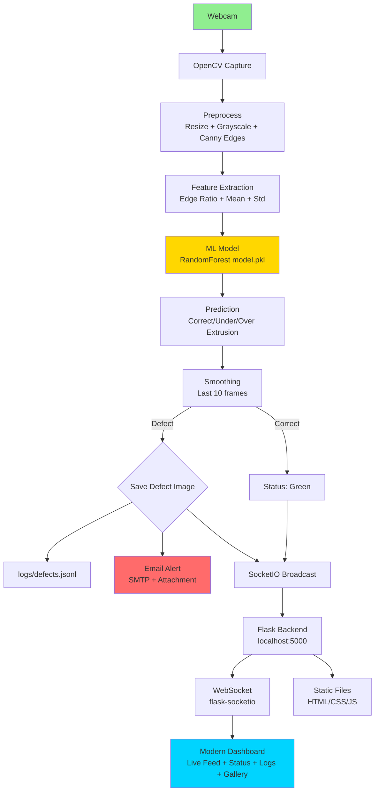

# Real-time AI-based 3D Printing Defect Detection System Architecture

## System Workflow



## Components

### 1. **Hardware Layer**
- **Webcam**: Continuous video capture (0.1s interval ~10FPS)

### 2. **Detection Pipeline** (`backend/detector.py`)
```
Frame → Resize(200x200) → Grayscale → Canny Edges → Features → Predict → Smooth → Output
```

### 3. **Backend Server** (`app.py`)
- Flask + SocketIO for real-time updates
- `/` → Dashboard
- `/logs` → Defect logs API
- `/defect_images/*` → Serve images
- Background thread: Detection → WebSocket emit → Email trigger

### 4. **Frontend Dashboard** (`static/`)
- **Live Feed**: Base64 video stream
- **Status**: Real-time indicator (green/red)
- **Defect Gallery**: Thumbnails with click-to-expand
- **Logs**: Timestamped entries with images
- **Industrial Design**: Dark theme, animations, responsive

### 5. **Alert System** (`email_alert.py`)
```
Defect → Capture Image → SMTP (Gmail) → Email with timestamp + attachment
```

### 6. **Data Storage**
```
defect_images/*.jpg
logs/defects.jsonl  (append-only)
```

## Deployment
```
cd dashboard
pip install flask flask-socketio eventlet
python app.py
→ Open http://localhost:5000
```

## Scalability
- Multi-camera: Add camera IDs to detector
- Cloud: Deploy Flask to Heroku/AWS, ngrok for webcam
- Database: SQLite/Postgres instead of JSONL

